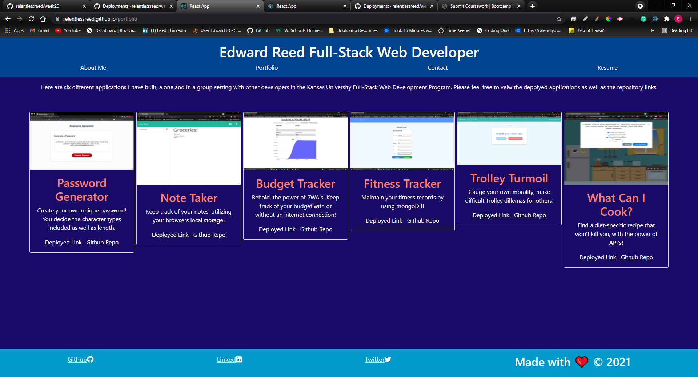

# React Portfolio 

  
[Link To Deployed Application](https://relentlessreed.github.io/week20)

# Description

My portfolio, refactored and rebuilt using React!

# Table Of Contents

- [Installation](#installation)
- [Usage](#usage)
- [License](#license)
- [Contributing](#contributing)
- [Tests](#tests)
- [Questions](#questions)

# Installation

User only needs a working browser to run.

# Usage

This will be used to demonstrate to employers my knowledge gained from my time as a student in the Trilogy Coding Bootcamp Program. It also shows that I understand the core concepts of React.

# License

This application is protected under conditions of the MIT license.

# Contributing

I am the only contributor to this project.

# Tests

No tests are needed at the moment.

# Questions

My GitHub Profile: http://www.github.com/relentlessreed  
Please feel free to contact me with any inquiries via email at relentlessreed@gmail.com.
